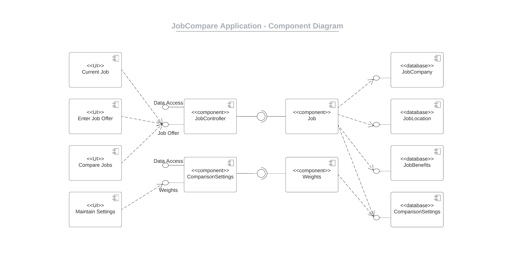
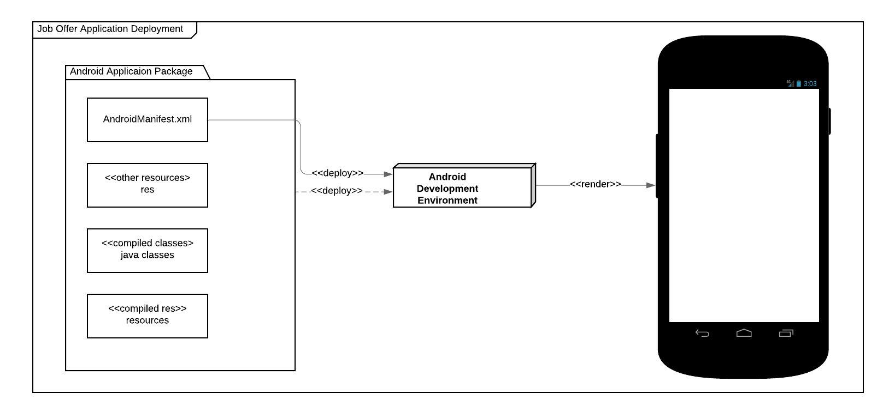
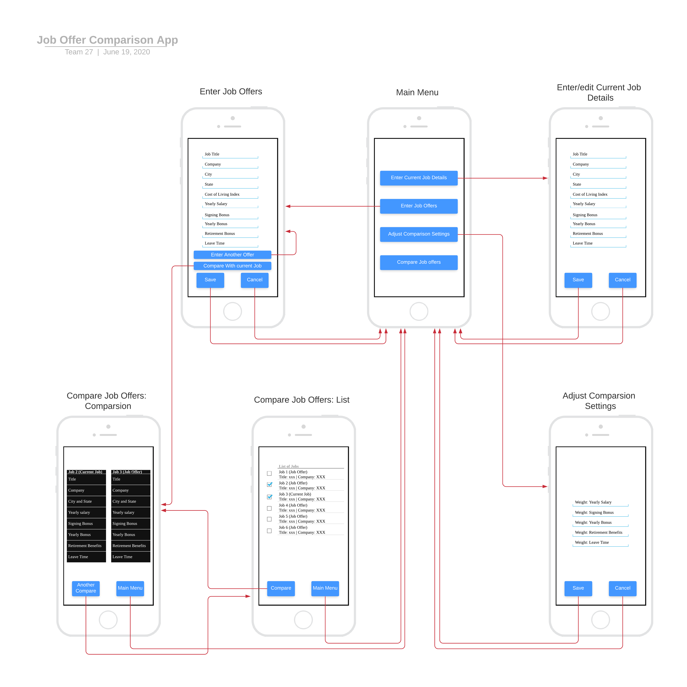

# Design Document

*This is the template for your design document. The parts in italics are concise explanations of what should go in the corresponding sections and should not appear in the final document.*

**Team 27**: 

## 1 Design Considerations

*The subsections below describe the issues that need to be addressed or resolved prior to or while completing the design, as well as issues that may influence the design process.*

### 1.1 Assumptions

*Describe any assumption, background, or dependencies of the software, its use, the operational environment, or significant project issues.*

#### Enviornment
* We will be creating the system in java to be run as an andriod app with an SQLite database for persistence. 
* While almost anything can be an andriod device now a days, we are focusing on scope on tradional android smart phones.

#### Dependencies
* We will attempt to create our app with minimal technical requirments to allow more devices to use it.
* We will only be using standard Java libraries
* It will be built in Android Studio

#### Assumptions
* Only one user will be using the system
  * This allows us to not have to build log in components
* The data only needs to presist locally and it not backed up by the cloud
* The user will posses a device that meets or specificaions and they will have the basic skill set needed to operate a android app

### 1.2 Constraints

*Describe any constraints on the system that have a significant impact on the design of the system.*

* The all around limitations of mobile devices, in the fact that they come with lower specs, smaller screens and less power, compared to their PC counter parts
* Screen real estate, mobile phones have smaller screens, making buttons and text size important. We can't take up to much room per item, but items must be readable and interactable.
* Input accurary, unlike PC's that typically have a mouse and keyboard, mobile phones use mostly touch screen.
  * This being a less accurate means of input gather means we must have higher fault tolerance.
* We are required to code the app in Java.
* The user is allowed to enter free text with no standard way for us to preform content validation.

### 1.3 System Environment

*Describe the hardware and software that the system must operate in and interact with.*

* The system must work on traditional Android phones and be set up as an app that a user can download and then run on their phone
* We will be using Android Version 8.0 with API level 26
* It will be written in Java using android studio

## 2 Architectural Design

*The architecture provides the high-level design view of a system and provides a basis for more detailed design work. These subsections describe the top-level components of the system you are building and their relationships.*

### 2.1 Component Diagram

*This section should provide and describe a diagram that shows the various components and how they are connected. This diagram shows the logical/functional components of the system, where each component represents a cluster of related functionality. In the case of simple systems, where there is a single component, this diagram may be unnecessary; in these cases, simply state so and concisely state why.*

### 2.2 Deployment Diagram

*This section should describe how the different components will be deployed on actual hardware devices. Similar to the previous subsection, this diagram may be unnecessary for simple systems; in these cases, simply state so and concisely state why.*

## 3 Low-Level Design

*Describe the low-level design for each of the system components identified in the previous section. For each component, you should provide details in the following UML diagrams to show its internal structure.*

### 3.1 Class Diagram

*In the case of an OO design, the internal structure of a software component would typically be expressed as a UML class diagram that represents the static class structure for the component and their relationships.*

## 4 User Interface Design
*For GUI-based systems, this section should provide the specific format/layout of the user interface of the system (e.g., in the form of graphical mockups).*

